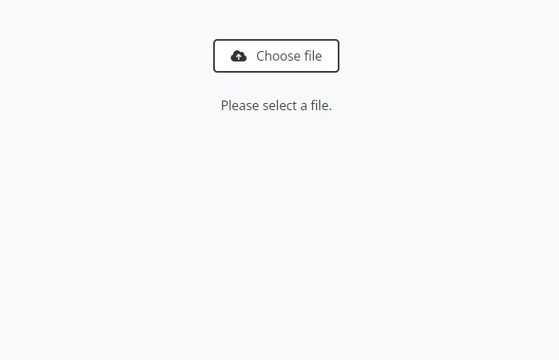
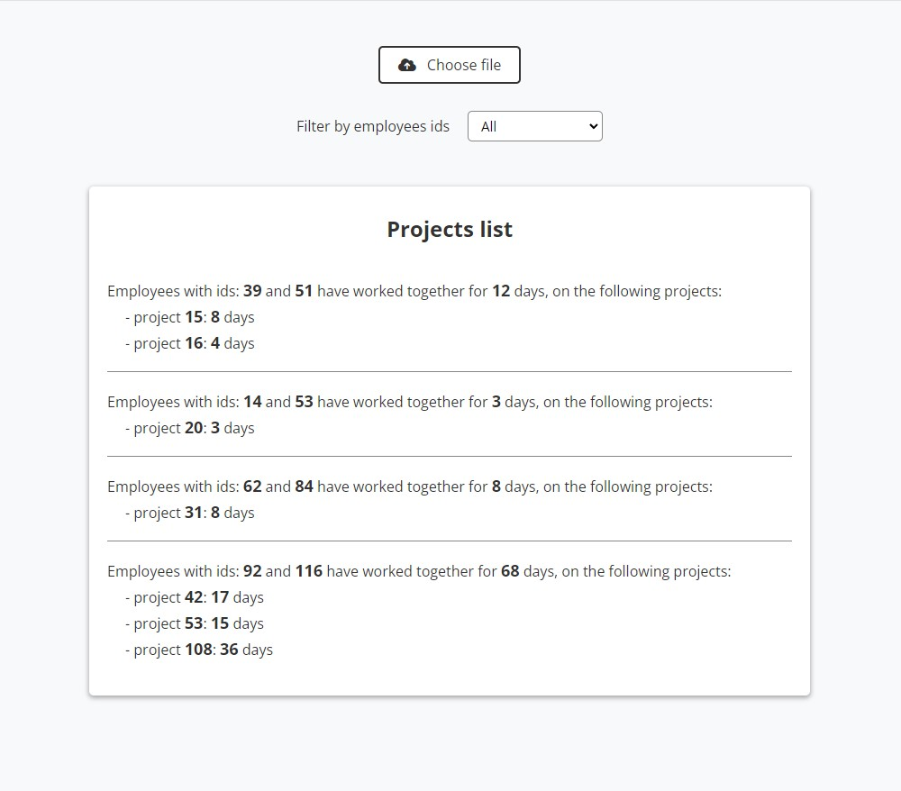
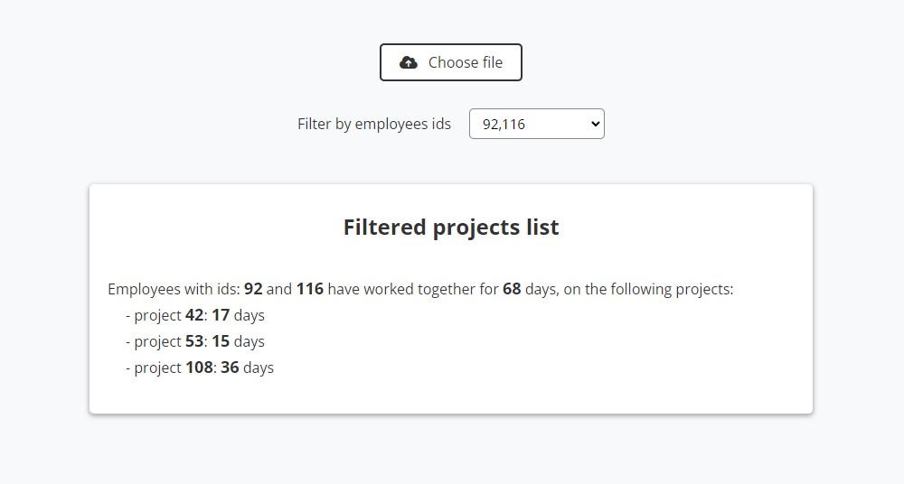

# Common Projects App

This is an application who identifies the pair of employees who have worked together on common projects and displays the time for each of those projects. \
The input data for the app is a csv file with data in the following format:
```
  EmployeeId, ProjectId, DateFrom, DateTo
  
  example:
  143, 12, 2013-11-01, 2014-01-05
  218, 10, 2012-05-16, NULL
  143, 10, 2009-01-01, 2011-04-27
```
DateTo can be NULL, equivalent to today.\
Sample output looks like this:
```
143, 218, 8
10, 5
12, 3
```

The project uses [React Router](https://reactrouter.com/en/main) for routing.\
For data handling it uses [React Context](https://react.dev/reference/react/createContext).


## How to start the app

This project was bootstrapped with [Create React App](https://github.com/facebook/create-react-app).
After downloading the project you have to install the dependencies with:
### `npm install`

After installing the dependencies you can start the app with:
### `npm start` 
or 
### `npm run start`
Runs the app in the development mode.\
Open [http://localhost:3000](http://localhost:3000) to view it in your browser.
If you want to build the app for production, you can run:
### `npm run build`
This will build the app in the `build` folder.

## What does the app look like
When started the app looks like this:\


After selecting a csv file with input data:\


With filtered results:\

